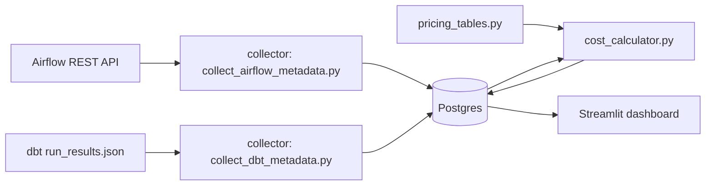

# pipeline-cost-observatory

A self-hosted **pipeline cost-attribution and observability dashboard** for Airflow and dbt. It answers the question most data teams cannot answer today: *"which pipeline, model, or team is actually driving our compute bill, and why did it change?"*

## The gap this fills

Data observability tools (Monte Carlo, Bigeye, Databand) focus on data quality and freshness, not cost. FinOps tools (Kubecost, CloudHealth) attribute infrastructure cost generically, but have no concept of an Airflow DAG or a dbt model. The result: most data teams track pipeline cost in an ad-hoc spreadsheet someone updates once a quarter, if at all.

```pipeline-cost-observatory``` is a small, transparent, open-source alternative. It ingests run metadata that Airflow and dbt already produce, applies an editable pricing table you control, attributes the resulting cost estimate to a pipeline/model/team, and puts it on a dashboard. No vendor contract, no black-box pricing model, no new infrastructure beyond a Postgres database.

## What it does

- Collects Airflow DAG run history (start/end time, duration, queue, tags) via the Airflow REST API
- Parses dbt `run_results.json` artifacts produced by every `dbt run` / `dbt build`
- Applies a configurable pricing table (compute $/hour by executor type: Databricks DBU, Fargate vCPU-hour, generic Airflow worker-hour) to estimate a $ cost per run
- Attributes each run's cost to a **team** and **pipeline** using DAG tags / dbt model `meta` blocks
- Persists everything in Postgres so history accumulates
- Serves a Streamlit dashboard: cost over time, cost by team, most expensive pipelines/models, and simple rolling-average anomaly flags

## Architecture



## Repository structure

```text
pipeline-cost-observatory/
├── db/
│   └── schema.sql                  # Postgres schema: pipeline_runs, cost_estimates, teams
├── ingestion/
│   ├── collect_airflow_metadata.py # Pulls DAG run stats from the Airflow REST API
│   └── collect_dbt_metadata.py     # Parses dbt run_results.json into Postgres
├── pricing/
│   └── pricing_tables.py           # Editable $/hour and $/unit pricing tables
├── cost_engine/
│   └── cost_calculator.py          # Core cost attribution + anomaly detection logic
├── dashboard/
│   └── app.py                      # Streamlit dashboard
├── helm/pipeline-cost-observatory/ # Helm chart for a real Kubernetes deployment
├── render.yaml                     # One-click Render blueprint deploy
├── tests/
│   └── test_cost_calculator.py
├── docs/
│   ├── ARCHITECTURE.md
│   └── DEPLOYMENT.md
├── docker-compose.yml
└── requirements.txt
```

## Getting started (local, Docker Compose)

```bash
git clone https://github.com/Kornelius99/pipeline-cost-observatory.git
cd pipeline-cost-observatory
docker compose up --build
```

This starts Postgres (seeded with sample pipeline runs so the dashboard has data immediately) and the Streamlit dashboard at http://localhost:8501.

To point the collectors at your own Airflow/dbt:

```bash
export AIRFLOW_BASE_URL=http://localhost:8080
export AIRFLOW_USERNAME=admin
export AIRFLOW_PASSWORD=admin
python ingestion/collect_airflow_metadata.py

python ingestion/collect_dbt_metadata.py --run-results-path ./target/run_results.json
```

See `docs/DEPLOYMENT.md` for full details, environment variables, and scheduling the collectors as cron jobs / Airflow DAGs themselves.

## Deploying for real

This project is meant to be actually deployed, not just run once locally:

- **Kubernetes**: a Helm chart is provided in `helm/pipeline-cost-observatory`. See `docs/DEPLOYMENT.md` for `helm install` instructions.
- **Render**: `render.yaml` is a Render Blueprint. Connect your fork to your own Render account and click "New Blueprint Instance" to deploy the dashboard + a managed Postgres database with no manual setup. (You'll need your own free Render account — this repo only provides the config.)

## Extending this project

- Add billing-API collectors for Snowflake/BigQuery/Databricks to replace the illustrative pricing table with real contracted rates
- Add Slack/Teams alerting when a pipeline's cost anomaly score crosses a threshold
- Join dbt model runs to warehouse query history for true bytes-scanned-based costing

## Honesty / limitations

- The pricing tables in `pricing/pricing_tables.py` are illustrative unit costs, not real cloud list prices — you must calibrate them to your actual contracted rates before trusting the dollar figures.
- Anomaly detection is a simple rolling z-score on run duration/cost, not a forecasting model.
- I (the author, with AI-assisted development) wrote and reviewed this code carefully, but have not run it against a live Airflow/dbt/Kubernetes environment — please test locally with `docker compose up` before deploying it for real or relying on it in an interview.

## License

MIT — see [LICENSE](LICENSE).
