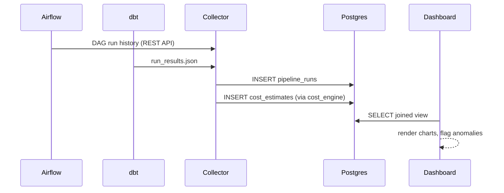

# Architecture notes

This document explains *why* the project is built the way it is, not just what the code does.

## Why Postgres as the single store

A cost-attribution tool doesn't need a data warehouse or a time-series database at the volumes most teams operate at (thousands, not billions, of pipeline runs per day). Postgres keeps the whole stack to two moving parts (Postgres + a dashboard process), which matters for a project meant to be self-hosted by a small team without a dedicated platform engineer.

## Why collectors are separate scripts, not a long-running service

collect_airflow_metadata.py and collect_dbt_metadata.py are designed to be triggered by the orchestrators they're reading from: as a final Airflow task in each DAG, or as a post-hook in your CI/CD job that runs dbt build. This avoids running a third always-on polling service and means new runs show up within seconds of completing, not on a fixed polling interval.

## Why a rolling z-score for anomaly detection, not a forecasting model

FinOps-style cost anomaly detection is dominated by a simple failure mode: someone forgets to scale a cluster down, or a bug causes a job to reprocess all history instead of an incremental batch, and the cost triples. A rolling z-score over the last N runs of the SAME pipeline catches this class of problem well, is trivial to explain to a non-technical stakeholder in a Slack alert, and doesn't require labeled training data or a model-serving story. A learned forecasting model (e.g. Prophet, an LSTM) would be more sensitive to gradual drift but is a legitimate v2 extension - see the README's Extending this project section.

## Why executor_type is a free-text tag rather than a strict enum enforced at the database layer

Teams' compute mix changes faster than a schema migration cycle. pricing/pricing_tables.py fails loudly (raises ValueError) on an unrecognized executor_type rather than silently defaulting to $0, which is the safer failure mode for a cost tool: better to break a collector run than to quietly under-report spend.

## Data flow

## Known simplifications (read before relying on the numbers)

- Pricing is a flat $/hour rate per executor type; it does not account for spot/reserved discounts, data transfer cost, or storage cost.
- dbt model cost currently assumes one fixed executor_type per project run (via --executor-type); a v2 could parse per-model warehouse size overrides from dbt_project.yml meta blocks.
- Multi-tenancy (many teams' data in one instance with access control) is not implemented; this is a single-tenant tool today.
